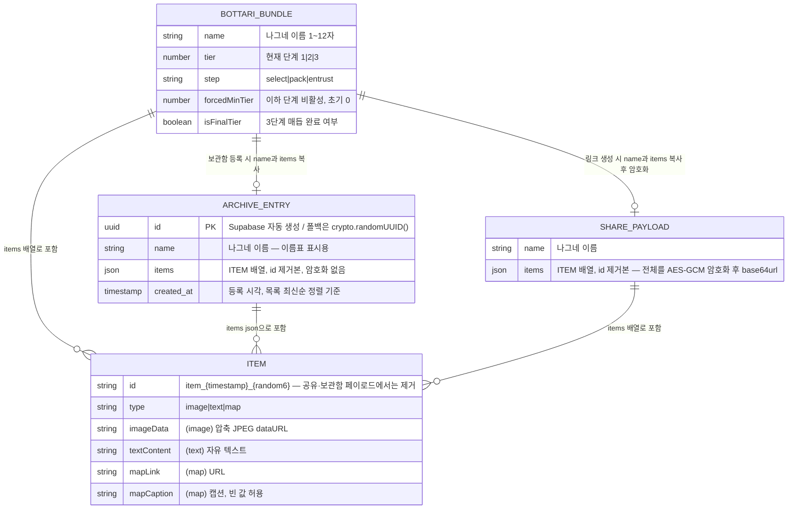
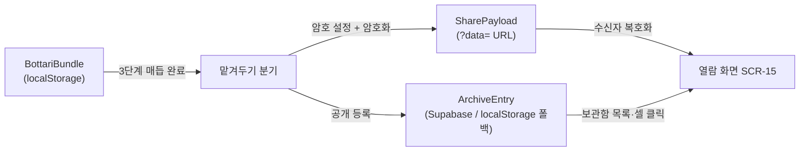

# 보따리(Bottari) Renewal — ERD
Version: 2.0
Date: 2026-07-17
상위 문서: `PRD.md` v2.0 (데이터 모델) · `기능명세서.md` §2 (저장 규칙 — 필드 정본)
다음 순서 문서: `권한정책.md` → `api_명세서.md` → `qa_테스트_케이스.md`

---

## 0. 저장소 구성 개요

백엔드 서버가 없는 정적 사이트이므로, 데이터는 세 계층에 나뉘어 산다.
관계형 DB 테이블은 보관함 1개(`bottari_archive`)뿐이고, 나머지는 클라이언트 로컬 엔티티다.

| 계층 | 엔티티 | 물리 저장소 | 수명 |
|---|---|---|---|
| 진행 상태 | BottariBundle | localStorage `bottari_bundle_v2` | '처음으로 돌아가기' 또는 초기화까지 |
| 설정 | Settings | localStorage `bottari_settings_v1` | 초기화까지 |
| 보관함 | ArchiveEntry | Supabase `bottari_archive` 테이블 (미설정 시 localStorage `bottari_archive_v1`) | 꺼내기(FN-23)로만 삭제 가능 |
| 소유 증명 | OwnedRef | localStorage `bottari_owned_v1` — `[{ id, ownerToken }]` | 초기화까지 (유실 시 꺼내기 불가) |
| 공유 페이로드 | SharePayload | URL `?data=` 파라미터 (암호화) | URL 자체가 저장소 — 별도 보존 없음 |

## 1. 엔티티 관계도

- 엔티티 ↔ 기능명세서 대응: BOTTARI_BUNDLE = §2.2 BottariBundle / ARCHIVE_ENTRY = §2.4 ArchiveEntry
  / ITEM = §2.2의 `items[]` 필드 / SHARE_PAYLOAD = FN-15 1항의 공유 페이로드 `{ name, items }`.
- ITEM은 독립 테이블이 아니라 각 엔티티에 **내장(embedded)** 되는 값 객체다.
  관계선은 "구조 포함"을 뜻하며 외래 키가 아니다.
- BottariBundle → ArchiveEntry / SharePayload 관계는 **등록·생성 시점의 스냅숏 복사**다.
  이후 진행 상태를 바꿔도 이미 등록·공유된 데이터에는 반영되지 않는다.

## 2. Supabase 테이블 정의 — `bottari_archive`

유일한 관계형 테이블. DDL 원문과 RLS는 `DB_SETUP.md`(구현 단계 작성)와 `권한정책.md`에서 다룬다.

| 컬럼 | 타입 | 제약 | 설명 |
|---|---|---|---|
| `id` | `uuid` | PK, `default gen_random_uuid()` | 자동 생성 |
| `name` | `text` | `not null` | 나그네 이름 (클라이언트에서 1~12자 보장 — FN-04) |
| `items` | `jsonb` | `not null` | ITEM 배열 (최종 보따리이므로 항상 1~3개, `id` 제거본) |
| `created_at` | `timestamptz` | `not null`, `default now()` | 등록 시각. `GET`은 이 컬럼 내림차순 |
| `owner_token_hash` | `text` | `not null` | 소유 토큰(`ownerToken`)의 SHA-256 hex. 꺼내기(RPC `remove_bottari`) 대조용. **토큰 원문은 저장하지 않는다** |

- `items` 내부 구조는 DB 레벨에서 검증하지 않는다(클라이언트 단일 작성자 전제).
  스키마 정본은 기능명세서 §2.2의 items 필드 정의다.
- 인덱스: PK 외에 `created_at` 내림차순 정렬용 인덱스 1개(`idx_bottari_archive_created_at`).

## 3. localStorage 폴백 스키마

Supabase 미설정 시 `bottari_archive_v1` 키에 ArchiveEntry 배열을 JSON으로 직렬화한다.

- 배열 순서 = 최신순 (등록 시 맨 앞 삽입 — FN-17). 별도 정렬 없음. 꺼내기(FN-23)는 해당 id 항목 제거.
- 폴백 모드는 `owner_token_hash`를 두지 않는다 — 본인 브라우저 데이터이므로 `bottari_owned_v1`의 id 존재 여부만으로 소유를 판정한다.
- `id`: `crypto.randomUUID()`, `created_at`: ISO 8601 문자열.
- 컬럼 구조는 §2와 동일 — 모드 전환 시 코드가 동일 형태를 소비할 수 있게 유지한다.
  (단, 두 저장소 간 데이터 이관은 하지 않는다 — 범위 밖.)

## 4. 데이터 흐름 요약

- SharePayload는 암호 없이는 읽을 수 없고(AES-GCM), ArchiveEntry는 암호화 없이 공개된다.
  같은 items 구조의 두 갈래 사본이라는 점이 이 앱 데이터 모델의 전부다.
