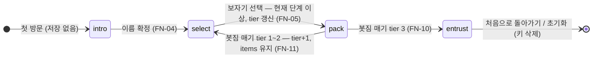

# 보따리(Bottari) Renewal — 기능명세서
Version: 2.0
Date: 2026-07-16
상위 문서: `PRD.md` v2.0 (FR-01~14) · `DESIGN.md` v2.0 (**§0 확정 사항이 최상위 기준**)
짝 문서: `화면흐름도.md` (화면 전이 정의 — 이 문서의 FN ID와 상호 참조)
다음 순서 문서: `erd.md` → `권한정책.md` → `api_명세서.md` → `qa_테스트_케이스.md` → `DB_SETUP.md`
계승 코드 원형: `D:\claude_code\vibe\Project\app\js\` (image.js · crypto.js · sharelink.js)

---

## 0. 문서 규칙

- 기능 ID는 `FN-xx`. PRD의 요구사항 `FR-xx`, DESIGN.md §7의 화면 `SCR-xx`와 매핑한다.
- 화면 구성·컴포넌트·카피 원문은 DESIGN.md(§6·§7·§8)가 정본이다. 이 문서는 **동작 규칙**만 정의한다.
- 사용자에게 보이는 시스템 문안(토스트·인라인 에러)은 §3.3 문안표의 것만 사용한다.
- 데이터 엔티티는 PRD 데이터 모델의 **BottariBundle**(진행 상태)과 **ArchiveEntry**(보관함)를 따르며, 저장 계층 상세는 §2에서 확정한다.

### FR ↔ FN ↔ SCR 매핑

| PRD FR | 기능명세 FN | 화면 SCR |
|---|---|---|
| FR-01 인트로 | FN-02, FN-03, FN-04 | SCR-01~04 |
| FR-02 보자기 선택 | FN-05 | SCR-05 |
| FR-03 아이템 담기 | FN-06, FN-07, FN-08, FN-09 | SCR-06 |
| FR-04 봇짐 매기 | FN-10, FN-11 | SCR-06, SCR-07 |
| FR-05 재선택 | FN-10, FN-11 | SCR-06, SCR-07 |
| FR-06 엔딩 | FN-12, FN-13 | SCR-08~10 |
| FR-07 암호 공유 | FN-14, FN-15 | SCR-11, SCR-12 |
| FR-08 수신자 열람 | FN-01, FN-16 | SCR-13 |
| FR-09 보관함 등록 | FN-17 | SCR-10 → SCR-14 |
| FR-10 보관함 열람 | FN-18 | SCR-14 |
| FR-11 열람 화면 | FN-19 | SCR-15 |
| FR-12 설정 | FN-20, FN-21 | 설정 모달 |
| FR-13 사운드 | FN-22 | 전 화면 |
| FR-14 상태 유지 | FN-01, §2 | 부팅 라우팅 |
| FR-15 보관함에서 꺼내기 | FN-23 | SCR-15 → SCR-14 |

---

## 1. 모듈 구성 (`js/`)

노빌드 원칙에 따라 전 모듈은 `window.Bottari` 네임스페이스에 IIFE로 등록하고 `<script>`로 순서 로드한다.

| 파일 | 역할 | 출처 |
|---|---|---|
| `js/config.js` | `SUPABASE_URL` / `SUPABASE_ANON_KEY` 상수 2개. **둘 다 채워진 경우에만 Supabase 모드**, 하나라도 비면 localStorage 모드(§0-1). 설정 절차 주석 포함 | 신규 |
| `js/josa.js` | 은/는 조사 자동 선택 (§3.1) | 신규 |
| `js/storage.js` | localStorage 읽기/쓰기/검증 (§2) | 계승 + 확장(name·step 필드, 설정 키 분리) |
| `js/bundleService.js` | 단계 한도·아이템 추가/삭제·매듭/이월 규칙 | 계승 + 수정(**이월 시 items 유지** — FN-11) |
| `js/image.js` | 사진 canvas 단계적 압축 + 추가 축소 | 계승(수정 없음) |
| `js/crypto.js` | PBKDF2 + AES-GCM 암복호화 | 계승(수정 없음) |
| `js/sharelink.js` | `?data=` URL 생성/파싱, 2,000자 상한 | 계승(수정 없음) |
| `js/archive.js` | 보관함 등록/조회 — Supabase REST `fetch()` + localStorage 폴백 | 신규 |
| `js/sound.js` | BGM 루프 + SFX 4종 재생 제어 (FN-22) | 신규 |
| `js/app.js` | 화면 라우팅·렌더·이벤트 배선 | 신규 작성(기존 흐름 참고) |

- Supabase REST의 엔드포인트·헤더·에러 계약은 `api_명세서.md`에서 정의한다.

---

## 2. 상태 모델과 저장 규칙

### 2.1 localStorage 키

| 키 | 내용 | 삭제 시점 |
|---|---|---|
| `bottari_bundle_v2` | BottariBundle 진행 상태 | '처음으로 돌아가기'(FN-15·18) 또는 초기화(FN-21) |
| `bottari_settings_v1` | 설정 `{ soundEnabled: boolean }` (기본 `true`) | 초기화(FN-21)만 |
| `bottari_archive_v1` | ArchiveEntry 배열 — **localStorage 모드 전용** 보관함 폴백 | 초기화(FN-21) 또는 꺼내기(FN-23) |
| `bottari_owned_v1` | 내가 등록한 보따리 소유 증명 `[{ id, ownerToken }]` (FN-17에서 기록, FN-23에서 사용) | 초기화(FN-21)만 |

- PRD 개념 모델에서 `settings`는 BottariBundle 하위지만, 저장 계층에서는 별도 키로 분리한다.
  근거: '처음으로 돌아가기'는 진행 상태만 버리고 사운드 설정은 유지해야 하기 때문.
- 기존 배포본 키 `bottari_bundle_v1`은 스키마가 다르므로(이월 규칙·name·step 부재) 읽지 않는다.

### 2.2 BottariBundle 스키마 (`bottari_bundle_v2`)

| 필드 | 타입 | 설명 |
|---|---|---|
| `name` | string | 나그네 이름. 앞뒤 공백 제거 후 1~12자 (FN-04) |
| `tier` | number | 현재 단계 1/2/3 (한도 10/5/3) |
| `step` | string | 진행 위치: `"select"`(보자기 선택 대기) / `"pack"`(꾸리기 중) / `"entrust"`(3단계 매듭 완료, 맡겨두기 분기 이후) |
| `forcedMinTier` | number | 이 값 **이하** 단계는 지난 단계로 비활성 표시 (초기 0) |
| `items` | array | 담긴 아이템. **단계 이월 시 그대로 유지** |
| `items[].id` | string | 내부 식별자 `item_{timestamp}_{random6}` — 공유·보관함 페이로드에서는 제거 |
| `items[].type` | string | `"image"` \| `"text"` \| `"map"` (기존 코드의 `itemType`에서 개명 — PRD 표기가 정본) |
| `items[].imageData` | string | (image) 압축된 JPEG dataURL |
| `items[].textContent` | string | (text) 자유 텍스트 |
| `items[].mapLink` / `items[].mapCaption` | string | (map) URL + 캡션(캡션은 빈 값 허용) |
| `isFinalTier` | boolean | 3단계 매듭 완료 여부 |

- 공유용 암호는 **어떤 저장소에도 기록하지 않는다**(메모리 변수만 — FN-14).

`step` 전이는 다음과 같다. `intro`는 저장되지 않는 개념 상태(이름 확정 전에는 키 자체가 없음)다.

### 2.3 저장 시점

다음 순간마다 `bottari_bundle_v2`를 즉시 덮어쓴다(부분 갱신 없음).

1. 이름 확정 (FN-04) — 최초 생성
2. 보자기 선택 (FN-05) — `tier`(선택 단계)·`step: "pack"`
3. 아이템 추가/삭제 (FN-06~09)
4. 봇짐 매기 (FN-10·11) — tier·step·forcedMinTier·isFinalTier 갱신
5. 설정 변경(FN-20)은 `bottari_settings_v1`에 저장

### 2.4 ArchiveEntry 스키마 (보관함)

| 필드 | 타입 | 설명 |
|---|---|---|
| `id` | uuid | Supabase 자동 생성 / 폴백 모드는 `crypto.randomUUID()` |
| `name` | string | 나그네 이름 (이름표 표시용) |
| `items` | json | BottariBundle.items와 동일 구조에서 `id` 제거본. **암호화 없음(공개 전제)** |
| `created_at` | timestamp | 등록 시각. 목록 정렬 기준(최신순). 폴백 모드는 ISO 문자열 |

### 2.5 진행 상태 삭제 규칙

| 트리거 | `bundle_v2` | `settings_v1` | `archive_v1` | `owned_v1` | 이동 |
|---|---|---|---|---|---|
| '처음으로 돌아가기' (SCR-12·SCR-14 하단 버튼) | 삭제 | 유지 | 유지 | 유지 | SCR-01 |
| 초기화 (FN-21 확인 모달 통과) | 삭제 | 삭제 | 삭제 | 삭제 | SCR-01 |

- Supabase에 등록된 공개 보따리를 지우는 유일한 경로는 꺼내기(FN-23)다 — 초기화·처음으로 돌아가기로는 삭제되지 않는다.

---

## 3. 공통 규칙

### 3.1 이름 치환과 은/는 조사

- 카피의 `{이름}` 자리에는 `bundle.name`(수신·열람 화면에서는 페이로드/entry의 `name`)을 넣는다.
- `{이름}은/는`(SCR-04)의 조사는 이름 **마지막 문자**로 판정한다.

| 마지막 문자 | 판정 | 예 |
|---|---|---|
| 한글 음절, 받침 있음 — `(code − 0xAC00) % 28 > 0` | 은 | 민경은 |
| 한글 음절, 받침 없음 | 는 | 지수는 |
| 숫자 `0 1 3 6 7 8` (독음 영·일·삼·육·칠·팔) | 은 | 7은 |
| 숫자 `2 4 5 9` (독음 이·사·오·구) | 는 | 2는 |
| 영문 `l m n r`(대소문자 무관 — 독음 엘·엠·엔·알) | 은 | Kim은 |
| 그 외 영문 | 는 | Amy는 |
| 그 외 문자(특수문자·이모지 등) | 은(는) 병기 | ★은(는) |

### 3.2 아이템 추가 공통 규칙 (FN-06~08에서 참조)

1. 사전 조건: `items.length < limit`. 한도 도달(`n ≥ limit`) 시 추가 버튼 3종은 disabled(§0-4의 opacity 0.4 규칙 준용)이므로 정상 경로에서는 호출되지 않는다.
2. 방어: 비활성이 뚫린 채 추가가 시도되면 토스트 "이 보자기에는 더 담을 수 없어요"를 띄우고 무시한다.
3. 추가 성공 시: `id` 부여 → `items` push → 저장(§2.3) → 카운터·보드·버튼 상태 갱신 → `sfx_add` → 카드 페이드 인 + TranslateY 4px(DESIGN §9).

### 3.3 시스템 문안표

DESIGN §8 카피(화면 고정 문안) 외에, 상황 발생 시에만 노출되는 시스템 문안은 아래가 전부다.
"계승"은 기존 배포본 `app.js`의 문안 원문 그대로다.

| # | 상황 | 문안 | 표시 | 출처 |
|---|---|---|---|---|
| 1 | 한도 초과 상태에서 추가 시도(방어) | 이 보자기에는 더 담을 수 없어요 | 토스트 | 계승 |
| 2 | 글 모달 [담기] — 내용 빈 값 | 내용을 입력해 주세요 | 토스트 | 계승 |
| 3 | 지도 모달 [담기] — URL 형식 오류 | 올바른 URL 형식이 아니에요 | 인라인 | 계승 |
| 4 | 사진 형식 미지원·읽기 실패 | 지원하지 않는 이미지 형식이에요 | 토스트 | 계승 |
| 5 | 암호 4자 미만 | 암호는 4자 이상이어야 해요 | 인라인 | 계승 |
| 6 | 암호–확인 불일치 | 암호가 서로 달라요 | 인라인 | 계승 |
| 7 | 링크 생성 일반 실패 | 링크를 만들지 못했어요. 다시 시도해 주세요 | 토스트 | 계승 |
| 8 | 자동 이미지 축소(FN-15 4항, 최대 7회)를 소진해도 URL 2,000자 초과 | 이미지가 너무 커요. 아이템 수를 줄여 다시 시도해 주세요 | 토스트 | 계승 |
| 9 | 링크 복사 성공 | 복사했어요 | 토스트 | 계승 |
| 10 | 링크 복사 최종 실패 | 복사에 실패했어요. 직접 선택해 복사해 주세요 | 토스트 | 계승 |
| 11 | 수신자 암호 오류(복호화 실패) | 암호가 올바르지 않아요 | 인라인 | 계승 |
| 12 | 이름 빈 값(공백만 입력 포함) | 이름을 입력해 주세요 | 인라인 | ★신규 |
| 13 | 공유 링크 페이로드 손상 | 링크가 손상되어 열 수 없어요 | 인라인 | ★신규 |
| 14 | 보관함 등록 실패 | 보관함에 맡기지 못했어요. 다시 시도해 주세요 | 토스트 | ★신규 |
| 15 | 보관함 조회 실패 | 보따리를 불러오지 못했어요. 다시 시도해 주세요 | 토스트 | ★신규 |
| 16 | 꺼내기 실패 (FN-23) | 보따리를 꺼내지 못했어요. 다시 시도해 주세요 | 토스트 | ★신규(2026-07-17) |

- ★신규 4건(#12·13·14·15)은 **2026-07-16 사용자 확정** — 표의 문안 그대로 사용한다.

- 토스트: 1.5초 표시 후 페이드(CMP-Toast). 인라인: 해당 입력 필드 아래 `COLOR-Alert` 텍스트, 다음 확정 시도 때 지움.

### 3.4 화면 전환 공통

- 화면 전환은 페이드 Normal 250ms(DESIGN §9). 내레이션 텍스트는 페이드 인.
- 클릭 가능한 버튼·카드의 공통 클릭음은 `sfx_click`(FN-22).

---

## 4. 기능 상세

### FN-01 부팅 분기와 상태 복원
- 화면: 진입 라우팅 · FR-08, FR-14

1. 페이지 로드 시 `location.search`의 `data` 파라미터를 **최우선** 검사한다. 존재하면 저장된 진행 상태와 무관하게 SCR-13(수신자 열기)을 표시하고, 진행 상태는 읽지도 쓰지도 않는다.
2. `data`가 없으면 `bottari_bundle_v2`를 읽는다. JSON 파싱 실패 / 객체가 아님 / `items`가 배열이 아님 중 하나면 "저장 없음"으로 간주한다(기존 storage.js 검증 계승 — 손상 데이터는 삭제하지 않고 무시, 다음 저장이 덮어쓴다).
3. 복원 분기: 저장 없음 → SCR-01 / `step="select"` → SCR-05(tier 단계) / `step="pack"` → SCR-06(tier 단계, items 렌더) / `step="entrust"` → SCR-10.
4. 설정은 `bottari_settings_v1`에서 별도 로드. 없으면 `{ soundEnabled: true }`.

### FN-02 랜딩
- 화면: SCR-01 (시안 1) · FR-01

1. 구성은 DESIGN §7. 보관함·수신자용 진입 UI는 두지 않는다(시안 1 기준 — 보관함은 여정 완주로만, 수신자 화면은 `?data=` URL로만 진입).
2. [GO!] → SCR-02. 이 시점에는 아무것도 저장하지 않는다.

### FN-03 인트로 내레이션
- 화면: SCR-02 (시안 2), SCR-04 (시안 4) · FR-01

1. SCR-02: 카피 2문장(§8) + [다음] → SCR-03.
2. SCR-04: `{이름}` 치환과 은/는 조사(§3.1)를 적용한 카피 4문장 + [다음] → SCR-05(1단계).

### FN-04 이름 입력
- 화면: SCR-03 (시안 3) · FR-01

1. CMP-Input, placeholder `(이름)`, `maxlength=12`(12자 초과는 입력 자체 차단).
2. 확정(↵ 버튼 클릭 또는 Enter) 시 앞뒤 공백을 제거하고 검증: 결과가 1~12자면 통과.
3. 통과 → BottariBundle 최초 생성·저장: `{ name, tier: 1, step: "select", items: [], forcedMinTier: 0, isFinalTier: false }` → SCR-04.
4. 빈 값(공백만 입력 포함) → 인라인 문안 #12, 화면 잔류.
5. 중간 공백·특수문자·이모지는 허용한다(긴 이름의 표시는 이름표 말줄임이 처리 — FN-18).

### FN-05 보자기 선택
- 화면: SCR-05 (시안 5·8·10) · FR-02

1. CMP-TierCard 3장 지그재그 배치. 단계별 상태:
   - `단계 ≤ forcedMinTier` (지난 단계): grayscale + opacity 0.45 + 클릭 불가
   - `단계 > forcedMinTier` (현재 단계 이상): 정상 표시, 클릭 유효 — 상위 단계 직행 허용(PRD 제약 완화)
2. 카드 클릭 → `tier`를 선택한 단계로 갱신 + `step: "pack"` 저장 → SCR-06.
   이후 흐름은 선택한 단계 기준으로 기존 시나리오를 따른다
   (예: 2단계 직행 → 봇짐 매기 시 3단계 전환(FN-11), 3단계 직행 → 봇짐 매기 시 엔딩(FN-10)).
3. 말풍선 카피는 §8 원문에 이름 치환.
4. 우상단 ⚙ → 설정 모달(FN-20).

### FN-06 아이템 담기 — 사진
- 화면: SCR-06 (시안 6·9·11) · FR-03

1. 🖼 버튼 → `<input type="file" accept="image/*">` 파일 선택 다이얼로그(모달 없음).
2. 허용 MIME: `image/jpeg` `image/png` `image/webp` `image/gif`. 그 외와 읽기 실패는 토스트 #4.
3. 압축(계승 — image.js 수정 없음): 아래 단계를 순서대로 시도해 dataURL 길이가 **예산 700자** 이하가 되는 즉시 채택(전 단계 초과 시 마지막 결과 채택). 긴 변 기준 축소, 흰 배경 합성 후 JPEG 변환.

   | 순서 | 최대 변(px) | JPEG 품질 |
   |---|---|---|
   | 1 | 320 | 0.60 |
   | 2 | 240 | 0.50 |
   | 3 | 180 | 0.40 |
   | 4 | 128 | 0.35 |
   | 5 | 96 | 0.30 |
   | 6 | 64 | 0.30 |
   | 7 | 48 | 0.25 |

4. 성공 → `{ type: "image", imageData }`로 공통 추가(§3.2). 카드에는 썸네일 표시.

### FN-07 아이템 담기 — 글
- 화면: SCR-06 · FR-03

1. ✎ 버튼 → 글 모달(MD-Text): textarea(placeholder는 §8 "소중한 순간을 글로 남겨보세요") + [담기] [취소].
2. [담기]: trim 후 빈 값이면 토스트 #2, 모달 유지. 값이 있으면 `{ type: "text", textContent }`로 공통 추가(§3.2) 후 모달 닫기.
3. 글 길이 상한은 두지 않는다 — 공유 URL 2,000자 검사(FN-15)가 최종 안전장치(기존 배포본 계승).
4. 카드에는 첫 줄만 표시하고 넘치면 말줄임.

### FN-08 아이템 담기 — 지도
- 화면: SCR-06 · FR-03

1. 📍 버튼 → 지도 모달(MD-Map): 장소 링크(URL) 필드 + 캡션 필드(placeholder는 §8 "이 장소에 대한 짧은 기억") + [담기] [취소].
2. [담기]: URL을 `new URL()`로 검증. 실패 → 인라인 #3, 모달 유지.
3. 캡션은 선택 입력(trim, 빈 값 허용).
4. 통과 → `{ type: "map", mapLink, mapCaption }`으로 공통 추가(§3.2) 후 모달 닫기. 카드에는 📍 + 캡션(캡션이 없으면 링크 문자열).

### FN-09 아이템 삭제
- 화면: SCR-06 · FR-03

1. 카드 우상단 (–) 버튼(`img/contents_btn.png`, 시안 9·`draft/contents_wrap_delete.png`). 터치 영역 44px 이상.
2. 클릭 → 확인 절차 없이 즉시 삭제(계승) → 저장 → 카운터·버튼 상태 갱신 → `sfx_remove` → 카드 페이드 아웃.
3. 이월 초과 상태(FN-10)에서 한도 이하로 내려가는 유일한 수단이다.

### FN-10 카운터와 봇짐 매기
- 화면: SCR-06 · FR-04, FR-05 · 규칙 원천: §0-4

1. 카운터 `담은 개수 {n} / {limit}`: `n > limit`이면 n만 `COLOR-Alert`, `n ≤ limit`이면 `COLOR-Text`(CMP-Counter).
2. 추가 버튼 3종(🖼 ✎ 📍): `n ≥ limit`이면 disabled.
3. [봇짐 매기] 활성 조건: `1 ≤ n ≤ limit`. 벗어나면(0개 포함) disabled + opacity 0.4.
4. 활성 시 기본 차콜(`COLOR-Btn-Dark`), pressed 순간에만 현재 단계색 + `COLOR-Text` 텍스트(§4.2).
5. 클릭(활성) → `sfx_tie` → 펼친 보자기가 묶인 보따리 이미지로 스왑 + Scale 0.98→1 연출(Slow 400ms, §9) → 분기:
   - tier 1·2: FN-11(전환 연출·이월)
   - tier 3: `isFinalTier: true`, `step: "entrust"` 저장 → SCR-08

### FN-11 전환 연출과 아이템 이월
- 화면: SCR-07 (시안 7=1→2 "어휴", 시안 16=2→3 "흠") · FR-04, FR-05

1. SCR-07 진입 시점에 즉시 갱신·저장: `forcedMinTier: 현재 tier`, `tier: 현재 tier + 1`, `step: "select"`. **items는 그대로 유지** — 기존 MVP는 이 시점에 items를 비웠으나 리뉴얼은 이월한다(핵심 차이).
2. 연출: character_bb(1→2) / character_mb(2→3) + 말풍선 카피(§8, 이름 치환). 눈 내림 연출 포함(§9 — 캐릭터 등장 화면).
3. 시안 7·16에 버튼이 없으므로 **기본 3초 표시 후 자동으로** 다음 단계 SCR-05로 페이드 전환하고, 화면 탭 시 즉시 전환한다.
4. 연출 중 이탈해도 1의 저장 덕에 재방문 시 SCR-05로 복원된다.
5. 다음 SCR-06 진입 시 이월된 items가 그대로 렌더되고, `n > limit`인 동안 FN-10의 초과 상태(카운터 강조 + 매기 비활성 + 추가 비활성)가 적용된다.

### FN-12 완료와 엔딩 영상
- 화면: SCR-08 (시안 12), SCR-09 (시안 13) · FR-06

1. SCR-08: character_sb + 카피(§8) + [GO!] → SCR-09.
2. SCR-09: `img/video_ending.mp4`를 `muted` + `playsinline` + autoplay로 풀블리드 재생.
3. SCR-10 전환 트리거 3종(모두 페이드): `ended` 이벤트 / 재생 시작 실패(`play()` reject 또는 error — DESIGN §11 "실패 시 스킵") / 화면 탭(수동 스킵).

### FN-13 맡겨두기 분기
- 화면: SCR-10 (시안 14) · FR-06

1. 선택 카드 2장(카피 §8).
2. "소중한 이에게 맡기기" → SCR-11.
3. "보따리 보관함에 맡기기" → FN-17 등록 실행(성공 시 SCR-14, 실패 시 잔류).
4. 이 화면이 `step="entrust"`의 복원 지점이다. 진행 상태는 '처음으로 돌아가기' 전까지 유지되므로, 수용 기준 5의 "등록 → 열람" 검증도 이 지점에서 반복 가능하다.

### FN-14 암호 설정
- 화면: SCR-11 (시안 14-1-1) · FR-07

1. (암호) (암호 확인) 2개 필드(`type="password"`) + ↵ 확정. 안내 카피는 §8.
2. 검증(인라인, 각 필드 아래): 4자 미만 → #5 / 둘 불일치 → #6. 둘 다 위반이면 둘 다 표시.
3. 통과 → 암호를 메모리 변수에만 보관(localStorage 기록 금지) → FN-15 링크 생성 실행.
4. 생성 진행 중 확정 버튼 disabled(중복 클릭 방지 — 계승). 성공 시 SCR-12, 실패 시 잔류(문안은 FN-15).

### FN-15 공유 링크 생성·전달
- 화면: SCR-12 (시안 14-1-2) · FR-07

1. 페이로드: `{ name, items }` — 각 아이템에서 내부 `id` 제거(계승). tier는 항상 3이므로 싣지 않는다.
2. 암호화(계승 — crypto.js 수정 없음): PBKDF2(SHA-256, **150,000회**, 랜덤 salt 16B)로 AES-GCM 256 키 유도 → 랜덤 IV 12B로 암호화 → `salt ∥ IV ∥ 암호문`을 base64url 인코딩. 평문 검증자 없음 — GCM 인증 태그 성공/실패가 곧 암호 정오 판정.
3. URL 생성(계승): `{origin}{pathname}?data={암호문}`. 전체 길이 ≤ 2,000자.
4. 초과 시(계승): 모든 image 아이템을 아래 표의 `attempt` 단계로 재압축 → 새 salt·IV로 재암호화 → 재검사. image 아이템이 없거나 시도 소진(최대 7회) 시 토스트 #8 후 SCR-11 잔류.

   | attempt | 최대 변(px) | JPEG 품질 |
   |---|---|---|
   | 0 | 40 | 0.25 |
   | 1 | 32 | 0.20 |
   | 2 | 24 | 0.15 |
   | 3 | 20 | 0.12 |
   | 4 | 16 | 0.10 |
   | 5 이상 | 12 | 0.10 |

5. 그 외 생성 실패 → 토스트 #7 후 SCR-11 잔류.
6. SCR-12 구성: CMP-ShareBox(readonly URL + [복사]) + [공유하기] + [처음으로 돌아가기].
7. [복사]: `navigator.clipboard.writeText` → 실패 시 `select()` + `execCommand("copy")` 폴백 → 성공 토스트 #9 / 최종 실패 토스트 #10.
8. [공유하기]: `navigator.share({ title: "보따리", url })`. Web Share 미지원 브라우저에서는 버튼 숨김(계승 — [복사]가 대체 수단).
9. [처음으로 돌아가기] → §2.5 진행 상태 삭제 → SCR-01.

### FN-16 수신자 열람
- 화면: SCR-13 (시안 14-1-2-1) · FR-08

1. 진입: 부팅 분기(FN-01)의 `?data=` 감지. 랜딩 변형 레이아웃(§7) + 카피(§8).
2. (암호) 입력 + [열어보기] → `data` 파라미터 값을 복호화 시도.
3. 성공 → SCR-15(출처 share, `name`은 페이로드 값) 표시.
4. AES-GCM 인증 실패(암호 오류) → 인라인 #11, 잔류.
5. base64url 해석 불가·길이 부족(페이로드 손상) → 인라인 #13, 잔류.
6. 이 흐름에서는 진행 상태(`bottari_bundle_v2`)를 읽지도 쓰지도 않는다.

### FN-17 보관함 등록
- 화면: SCR-10에서 실행 · FR-09

1. 트리거: SCR-10 "보따리 보관함에 맡기기" 카드 클릭.
2. 등록 데이터: `{ name, items }`(아이템 `id` 제거, 암호화 없음 — §2.4 ArchiveEntry).
3. Supabase 모드: REST POST(계약은 `api_명세서.md`). localStorage 모드: `bottari_archive_v1` 배열 **맨 앞에** 삽입, `id`는 `crypto.randomUUID()`, `created_at`은 현재 시각 ISO 문자열.
3-1. 소유 증명(FR-15): 등록 직전 `ownerToken = crypto.randomUUID()` 생성. Supabase 모드는 토큰의 SHA-256 해시를 함께 등록(`api_명세서.md` §1). 성공 시 `bottari_owned_v1` 배열에 `{ id, ownerToken }`을 추가한다. 토큰 원문은 서버에 보내지 않는다(해시만).
4. 처리 중 카드 2장 disabled(중복 등록 방지). 성공 → SCR-14(방금 등록분이 맨 앞). 실패 → 토스트 #14, SCR-10 잔류.
5. 등록 성공 후에도 진행 상태는 삭제하지 않는다 — 삭제는 '처음으로 돌아가기'(§2.5)가 유일한 시점.

### FN-18 보관함 목록
- 화면: SCR-14 (시안 14-2-1) · FR-10

1. 진입: FN-17 등록 성공 직후, 또는 SCR-15(출처 archive)의 ←.
2. 데이터: Supabase 모드 GET(`created_at` 내림차순) / localStorage 모드 `bottari_archive_v1` 배열 순서 그대로(이미 최신순).
3. CMP-StorageGrid: 3열, **최소 12셀(4행 — 시안 14-2-1 기준)**. 항목이 12개를 넘으면 3열을 유지한 채 행을 추가한다. 채워진 셀: `img/sb.png` + 이름표. 남는 셀: 빈 흰 프레임.
4. 이름표(CMP-NameTag): 이름 길이만큼 가로 확장하되 최대 폭은 셀 폭까지, 초과분은 `..` 말줄임(DESIGN §6).
5. 채워진 셀 클릭 → SCR-15(출처 archive, 해당 entry). 빈 셀은 클릭 무반응.
6. 조회 실패 → 토스트 #15 + 빈 셀 그리드 표시.
7. 저장된 보따리가 0건이면 빈 셀 12개 그대로 표시(시드 데이터 금지 — §0·PRD).
8. [처음으로 돌아가기] → §2.5 진행 상태 삭제 → SCR-01.

### FN-19 보따리 열람
- 화면: SCR-15 (시안 14-2-2) · FR-11

1. 진입 출처 2종: **archive**(FN-18 셀 클릭) / **share**(FN-16 복호화 성공). 읽기 전용 — 진행 상태와 무관.
2. 제목 "나그네 {이름}의 보따리" + 캡션 카피(§8, 이름 치환).
3. 매듭 풀린 보자기(`img/wrap_sb.png` 겸용 — §10) 위에 아이템 썸네일 배치(최종 보따리는 항상 1~3개).
4. 하단 확대 프레임: 기본 빈 상태(시안 14-2-2). 썸네일 클릭 시 채움:
   - 사진: 저장된 이미지 전체 표시(공유 페이로드의 압축본이 원본이다)
   - 글: 전문 표시(길면 프레임 내부 스크롤)
   - 지도: 캡션 + 링크 열기 버튼(새 탭, `rel="noopener noreferrer"`)
5. ← 뒤로가기(CMP-BackBtn, 좌상단): 출처 archive → SCR-14 / 출처 share → 버튼 자체를 표시하지 않음(돌아갈 화면이 없음).
6. 꺼내기 버튼(FR-15): 출처 archive **이고** `entry.id`가 `bottari_owned_v1`에 있을 때만 하단에 [보관함에서 꺼내기] 표시(그 외 미표시). 클릭 → FN-23.

### FN-23 보관함에서 꺼내기
- 화면: SCR-15에서 실행 · FR-15

1. 노출 조건: FN-19 6항. 소유 증명이 없는 보따리(타인 등록분·초기화 후)에는 버튼이 없다 — 초기화하면 소유 증명도 사라져 다시는 꺼낼 수 없다(로그인 없는 구조의 한계, 사용자 수용).
2. 클릭 → 확인 모달(MD-RemoveConfirm): "이 보따리를 보관함에서 꺼낼까요?" 한 줄 + 확인/취소 (2026-07-17 사용자 확정 — 보조 문구 없음).
3. [확인] → Supabase 모드: RPC `remove_bottari(id, ownerToken)` 호출(계약은 `api_명세서.md` §2-1). localStorage 모드: `bottari_archive_v1`에서 해당 id 제거.
4. 성공 → `bottari_owned_v1`에서도 해당 항목 제거 → SCR-14로 이동(목록 재조회, 해당 셀 사라짐). 실패(네트워크·토큰 불일치) → 토스트 #16, SCR-15 잔류.
5. 처리 중 버튼 disabled(중복 호출 방지). 진행 상태(`bundle_v2`)와는 무관하다.

### FN-20 설정
- 화면: 설정 모달 (SCR-05·SCR-06 우상단 ⚙에서만 진입 — §7 명시 화면 한정) · FR-12

1. 모달 구성(§0-3): 제목 "설정" + **사운드 토글 + 초기화** 2항목만(암호 변경 없음).
2. 사운드 토글(CMP-Toggle, ON = `COLOR-Stage1-Yellow`): 전환 즉시 `bottari_settings_v1` 저장. ON 전환 순간 BGM 재생 시작(클릭이 사용자 제스처이므로 autoplay 제약 없음), OFF 전환 순간 즉시 정지.
3. [초기화](`COLOR-Danger`) → FN-21 확인 모달.
4. 닫기: 닫기 버튼 또는 오버레이 클릭.

### FN-21 전체 초기화
- 화면: 초기화 확인 모달 · FR-12

1. 확인 모달 문안(§8): "저장된 모든 데이터를 삭제할까요?" / "되돌릴 수 없습니다." + 확인/취소.
2. 확인 → localStorage 4개 키 전부 삭제(`bundle_v2`·`settings_v1`·`archive_v1`·`owned_v1` — §2.5) → 모달·설정 모두 닫기 → SCR-01. BGM은 계속 재생(설정이 기본 ON으로 복귀 — OFF 상태에서 초기화했다면 재생 시작).
3. 취소 → 설정 모달로 복귀.
4. Supabase의 공개 보따리는 삭제하지 않는다(내 브라우저 데이터만 삭제).

### FN-22 사운드
- 화면: 전 화면 · FR-13

1. 파일(§9 — 이름 고정, 교체만으로 변경 가능): `bgm/bottari_bgm.mp3`(루프) + `sound/sfx_click.mp3` `sfx_add.mp3` `sfx_remove.mp3` `sfx_tie.mp3`.
2. 기본 ON. `settings.soundEnabled = false`일 때는 일체의 재생을 수행하지 않는다.
3. SFX 매핑: 클릭 가능한 버튼·카드 공통 = `sfx_click` / 아이템 추가 성공 = `sfx_add` / 아이템 삭제 = `sfx_remove` / 봇짐 매기·완료 = `sfx_tie`.
4. BGM은 화면 전환과 무관하게 루프 지속. 부팅 시 이미 ON이면 autoplay 정책 때문에 즉시 재생하지 않고 **첫 사용자 인터랙션(클릭/터치)에서 시작**한다.
5. 음원 파일이 없거나 재생이 거부되어도 앱은 에러 없이 동작한다(재생 실패는 조용히 무시). 음원 확보는 구현 단계에서 CC0 후보 제시(§9).
6. 음원은 **-16 LUFS(웹 표준 라우드니스)로 정규화된 파일**을 넣는다. 재생 측에서 볼륨을 보정하지 않으므로, 교체 음원이 이 기준을 벗어나면 그대로 크거나 작게 들린다.

---

## 5. 수용 기준 매핑 (PRD ↔ FN)

`qa_테스트_케이스.md` 작성 시 이 표를 출발점으로 삼는다.

| PRD 수용 기준 | 담당 FN |
|---|---|
| 1. 이름·조사 전 화면 치환 | FN-03, FN-04, FN-19 + §3.1 |
| 2. 이월 10/5 초과 표시·매기 잠금 | FN-10, FN-11 |
| 3. 완료 → 영상 → 분기 도달 | FN-10, FN-12, FN-13 |
| 4. 공유 URL 2,000자·암호 정오 판정 | FN-14, FN-15, FN-16 |
| 5. 보관함 등록·열람·폴백 동작 | FN-17, FN-18, FN-19, FN-23 |
| 6. 키 2개 입력만으로 모드 전환 | §1 config.js, FN-17, FN-18 |
| 7. 사운드 토글·초기화 | FN-20, FN-21, FN-22 |
| 8. 시안 15화면·반응형·콘솔 0 | 전 FN 공통 + DESIGN §11 게이트 |
