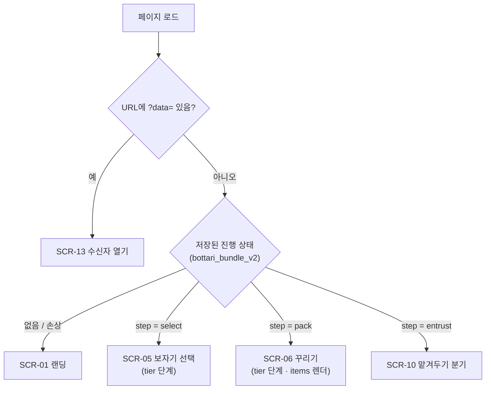
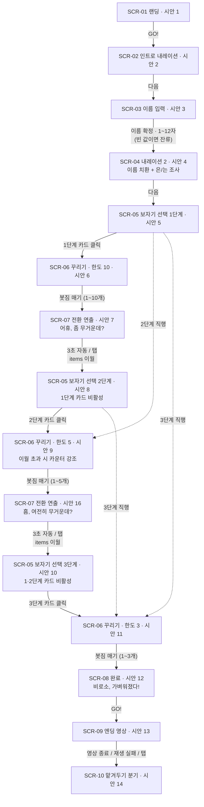
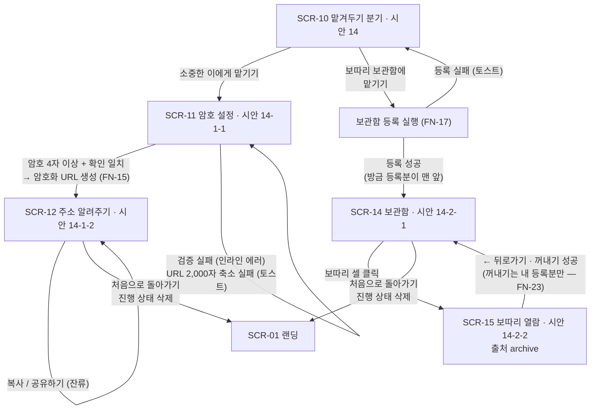
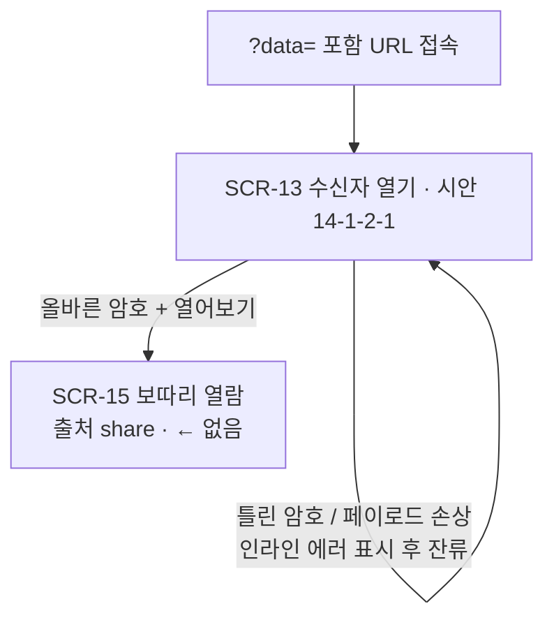

# 보따리(Bottari) Renewal — 화면흐름도
Version: 2.0
Date: 2026-07-16
상위 문서: `PRD.md` v2.0 · `DESIGN.md` v2.0 (§7 화면 정의·§8 카피 원문)
짝 문서: `기능명세서.md` (FN 동작 규칙 — 이 문서의 전이 조건과 상호 참조)

---

## 0. 화면 목록

| ID | 화면 | 시안 | 헤더 ⚙ | 담당 FN |
|---|---|---|---|---|
| SCR-01 | 랜딩 | 1 | 없음 | FN-02 |
| SCR-02 | 인트로 내레이션 | 2 | 없음 | FN-03 |
| SCR-03 | 이름 입력 | 3 | 없음 | FN-04 |
| SCR-04 | 인트로 내레이션 2 | 4 | 없음 | FN-03 |
| SCR-05 | 보자기 선택 | 5, 8, 10 | 있음 | FN-05 |
| SCR-06 | 보따리 꾸리기 | 6, 9, 11 | 있음 | FN-06~10 |
| SCR-07 | 전환 연출 | 7, 16 | 없음 | FN-11 |
| SCR-08 | 완료 | 12 | 없음 | FN-12 |
| SCR-09 | 엔딩 애니메이션 | 13 | 없음 | FN-12 |
| SCR-10 | 맡겨두기 분기 | 14 | 없음 | FN-13, FN-17 |
| SCR-11 | 암호 설정 | 14-1-1 | 없음 | FN-14 |
| SCR-12 | 주소 알려주기 | 14-1-2 | 없음 | FN-15 |
| SCR-13 | 수신자 열기 | 14-1-2-1 | 없음 | FN-16 |
| SCR-14 | 보관함 | 14-2-1 | 없음 | FN-18 |
| SCR-15 | 보따리 열람 | 14-2-2 | 없음(← 좌상단) | FN-19, FN-23 |

- 모달(글 입력·지도 입력·설정·초기화 확인)은 화면 위 오버레이로, §4에서 별도 정의.

---

## 1. 부팅 분기 (FN-01)

페이지 로드 시 단 한 번 수행하는 라우팅. `?data=`가 저장 상태보다 우선한다.

- 손상 데이터(파싱 실패·스키마 불일치)는 "없음"과 동일하게 처리한다(기능명세서 FN-01).
- 설정(`bottari_settings_v1`)은 분기와 무관하게 항상 로드한다.

---

## 2. 메인 여정 — SCR-01 → SCR-10

3단계 축소 루프를 펼쳐 그린 전체 경로. 이월(items 유지)은 SCR-07에서 일어난다.
보자기 선택에서는 현재 단계 이상 어느 카드든 클릭할 수 있다 — 상위 단계 직행은 점선 경로.

### 단계 요약

| 단계 | 보자기 | 한도 | SCR-06 진입 시 items | 전환 연출 캐릭터 |
|---|---|---|---|---|
| 1 | 큰 보자기(줄무늬) | 10 | 0개(첫 시작) | character_bb (1→2) |
| 2 | 중간 보자기(도트) | 5 | 1단계에서 담은 그대로 이월 | character_mb (2→3) |
| 3 | 작은 보자기(하트) | 3 | 2단계에서 담은 그대로 이월 | — (완료로 진행) |

- [봇짐 매기]는 `1 ≤ 담은 개수 ≤ 한도`일 때만 활성(0개·초과 모두 잠금 — FN-10).
- SCR-06 안의 아이템 추가(사진/글/지도 모달)·삭제는 화면 이동 없이 잔류한다(§4 모달 참조).

---

## 3. 맡겨두기 분기 — 공유 경로와 보관함 경로

- '처음으로 돌아가기'는 진행 상태(`bottari_bundle_v2`)만 삭제한다 — 설정·보관함 데이터는 유지(기능명세서 §2.5).
- 등록 성공 후에도 진행 상태는 남아 있으므로, SCR-14에서 이탈 후 재방문하면 SCR-10으로 복원된다(FN-17).

---

## 4. 수신자 흐름

공유 URL(`?data=`)로 접속한 수신자의 경로. 진행 상태와 완전히 분리된다.

- 실패 시 인라인 문안 구분(기능명세서 §3.3): 틀린 암호(복호화 실패) → "암호가 올바르지 않아요" / 페이로드 손상(base64url 해석 불가) → "링크가 손상되어 열 수 없어요".
- 출처 share의 SCR-15에는 ← 버튼을 표시하지 않는다(돌아갈 화면이 없음 — FN-19).
- 확대 열람(썸네일 클릭 → 하단 프레임)은 화면 이동이 아니라 SCR-15 내부 상태다.

---

## 5. 모달 흐름

모달은 화면 위 오버레이이며, 닫히면 원래 화면 상태로 복귀한다(화면 전환 아님).

| 모달 | 여는 곳 | 확정 동작 | 취소/닫기 |
|---|---|---|---|
| MD-Text 글 입력 | SCR-06 ✎ | 내용 있으면 담기 → 닫힘 / 빈 값이면 토스트 후 유지 | [취소] → 닫힘(입력 버림) |
| MD-Map 지도 입력 | SCR-06 📍 | URL 유효하면 담기 → 닫힘 / 형식 오류면 인라인 후 유지 | [취소] → 닫힘(입력 버림) |
| MD-Settings 설정 | SCR-05·SCR-06 ⚙ | 사운드 토글(즉시 저장) / [초기화] → MD-ResetConfirm | 닫기 버튼·오버레이 클릭 → 닫힘 |
| MD-ResetConfirm 초기화 확인 | MD-Settings [초기화] | [확인] → 전체 삭제 → 모달 모두 닫힘 → SCR-01 | [취소] → MD-Settings 복귀 |
| MD-RemoveConfirm 꺼내기 확인 | SCR-15 [보관함에서 꺼내기] (내 등록분만 노출 — FN-23) | [확인] → 삭제 → SCR-14 (실패 시 토스트 후 SCR-15 잔류) | [취소] → 닫힘 |

- 사진 추가(🖼)는 모달 없이 OS 파일 선택 다이얼로그를 연다(FN-06).

---

## 6. 화면별 진입·이탈 표

| 화면 | 진입 경로 | 이탈 경로 |
|---|---|---|
| SCR-01 랜딩 | 첫 방문 부팅 · '처음으로 돌아가기' · 초기화 완료 | [GO!] → SCR-02 |
| SCR-02 내레이션 | SCR-01 | [다음] → SCR-03 |
| SCR-03 이름 입력 | SCR-02 | 이름 확정 → SCR-04 (빈 값이면 잔류) |
| SCR-04 내레이션 2 | SCR-03 | [다음] → SCR-05(1단계) |
| SCR-05 보자기 선택 | SCR-04 · SCR-07 · 복원(step=select) | 현재 단계 이상 카드 → SCR-06 (상위 단계 직행 허용 · 지난 단계 비활성) |
| SCR-06 꾸리기 | SCR-05 · 복원(step=pack) | [봇짐 매기] → SCR-07(1·2단계) / SCR-08(3단계). 추가·삭제·모달은 잔류 |
| SCR-07 전환 연출 | SCR-06(1·2단계 매듭) | 3초 자동 · 탭 → SCR-05(다음 단계) |
| SCR-08 완료 | SCR-06(3단계 매듭) | [GO!] → SCR-09 |
| SCR-09 엔딩 영상 | SCR-08 | 영상 종료 · 재생 실패 · 탭 → SCR-10 |
| SCR-10 맡겨두기 분기 | SCR-09 · 복원(step=entrust) · 등록 실패 잔류 | 소중한 이 → SCR-11 / 보관함 → 등록 후 SCR-14 |
| SCR-11 암호 설정 | SCR-10 | 검증+생성 성공 → SCR-12 (실패 잔류) |
| SCR-12 주소 알려주기 | SCR-11 | [처음으로 돌아가기] → SCR-01 (복사·공유는 잔류) |
| SCR-13 수신자 열기 | `?data=` 부팅(유일한 진입) | 복호화 성공 → SCR-15(share) (실패 잔류) |
| SCR-14 보관함 | 등록 성공 · SCR-15(archive)의 ← | 셀 클릭 → SCR-15 / [처음으로 돌아가기] → SCR-01 |
| SCR-15 보따리 열람 | SCR-14 셀 클릭(archive) · SCR-13 성공(share) | archive: ← → SCR-14 · 꺼내기 성공 → SCR-14 / share: 앱 내 이탈 없음(탭 닫기) |

- ⚙ 설정 모달은 SCR-05·SCR-06에서만 열린다(§7 명시 화면 한정 — FN-20).

---

## 7. 이탈·복원 매핑 (FR-14)

진행 중 새로고침·브라우저 종료 후 재방문했을 때의 복귀 지점. 부팅 분기(§1)의 결과와 동일하다.

| 이탈 시점 | 저장된 step | 재방문 시 복귀 화면 |
|---|---|---|
| 랜딩~이름 확정 전 (SCR-01~03) | 저장 없음 | SCR-01 (처음부터) |
| 이름 확정~보자기 선택 전 (SCR-04, SCR-05) | select | SCR-05 (tier 단계 · 지난 단계 비활성 유지) |
| 꾸리기 중 (SCR-06) | pack | SCR-06 (tier 단계 · items 복원 · 초과 시 강조 상태 그대로) |
| 전환 연출 중 (SCR-07) | select (진입 시점에 이미 tier+1 저장) | SCR-05 (다음 단계) |
| 완료~엔딩~분기 이후 (SCR-08~12, SCR-14) | entrust | SCR-10 (맡겨두기 분기) |
| 수신자 흐름 (SCR-13·15) | 저장하지 않음 | `?data=` URL로 다시 접속하면 SCR-13 |

- SCR-08·09(완료·영상)에서 이탈해도 복귀 지점은 SCR-10이다 — 매듭(step=entrust)이 이미 저장된 뒤이므로 연출만 건너뛴다.
- 공유용 암호는 저장하지 않으므로(FN-14), SCR-11·12에서 이탈하면 SCR-10에서 암호 설정부터 다시 진행한다(링크 재발급).
